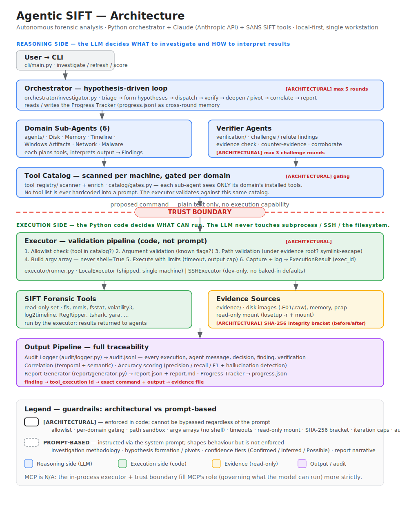

# Agentic SIFT

Autonomous forensic analysis powered by Claude + SIFT. Built for the [SANS Find Evil! Hackathon](https://findevil.devpost.com/) (Apr 15 – Jun 15, 2026).

A Python CLI orchestrator that drives Claude (via the Anthropic API) through hypothesis-driven forensic investigations on the SIFT workstation. The LLM decides *what* to investigate and *how to interpret* results. The Python code controls *what can be executed* and *what tools are available*.

## Quick Start

The default and recommended way to run is locally, on a single SIFT
workstation with Claude API access configured (`ANTHROPIC_API_KEY`) — the
forensic tools, the evidence image, and the read-only mount all live on the
same machine:

```bash
# Clone the repo
git clone https://github.com/joshfrogers/Find-Evil-Hackathon.git agentic-sift
cd agentic-sift

# Run an investigation (local, single-machine — no SSH)
python -m cli.main investigate --evidence /cases/image.E01 --type disk
```

> **Optional — remote execution (development only).** If you are developing
> against a SIFT VM on a separate host, you can run the tools over SSH. Every
> connection detail is caller-supplied — there are no baked-in defaults: pass
> `--remote HOST:PORT` (the port is required) and `--remote-user LOGIN`. See
> [Remote execution (development)](#remote-execution-development).

> **Mounting evidence needs root.** Disk images are mounted **read-only** via
> `sudo` (`losetup -r` + `mount`). As its first step, a local investigation
> prompts for your sudo password (on a stock SANS SIFT workstation the default
> user's password is `forensics`). To run non-interactively, set
> `AGENTIC_SIFT_SUDO_PASSWORD` in the environment. If sudo is already
> passwordless (a `NOPASSWD` sudoers entry, or credentials already cached), just
> press Enter at the prompt.

## Architecture



> Full diagram with trust boundaries and the architectural-vs-prompt guardrail table: **[docs/ARCHITECTURE.md](docs/ARCHITECTURE.md)**.

<details>
<summary>Text version</summary>

```
User → CLI → Orchestrator (hypothesis-driven)
                  │
          ┌───────┼───────┐
          ↓       ↓       ↓
      Sub-Agent  Sub-Agent  Sub-Agent
      (Disk)    (Memory)   (Timeline)
          │       │         │
          ↓       ↓         ↓
      Tool Catalog (scanned + gated per machine)
          │       │         │
          ↓       ↓         ↓
      Executor (allowlist + path validation)
          │       │         │
          ↓       ↓         ↓
      Verifier Agents (challenge findings)
          │       │         │
          └───────┼─────────┘
                  ↓
          Report Generator
```

</details>

**Key design:** The LLM never touches `subprocess` directly. Every command passes through the executor's validation pipeline:

1. **Allowlist check** — is this binary in the tool registry?
2. **Path validation** — are evidence paths under allowed roots? Symlink escape detection.
3. **Argv array construction** — no shell interpolation, ever.
4. **Execution with limits** — per-tool timeouts, output size caps.
5. **Audit logging** — every execution logged with unique ID for traceability.

These are **architectural guardrails**, not prompt-based. The code enforces them regardless of what the LLM requests.

## How It Works

1. **Initial Triage** — lightweight tools (mmls, fsstat, img_stat) to understand the evidence
2. **Hypothesis Formation** — Claude forms 1-3 hypotheses based on triage (e.g., "Ransomware via phishing," "Lateral movement via RDP")
3. **Sub-Agent Dispatch** — specialized agents test each hypothesis using only their domain's tools
4. **Verification** — verifier agents challenge high-value findings by seeking counter-evidence
5. **Iteration** — orchestrator evaluates hypotheses, pivots if refuted, re-dispatches (max 5 rounds)
6. **Report** — structured report with confidence levels, evidence links, and accuracy metadata

## Project Structure

```
agentic-sift/
├── tool_registry/          # Tool catalog — scanner, enrichment, staleness gates
│   ├── scanner.py          # Enumerate installed tools (PATH/dpkg/pip)
│   ├── enrich.py           # LLM-grounded tool metadata with provenance
│   └── catalog.py          # Load/merge/staleness; CatalogMissing handling
├── catalog/                # Fail-open tool gating (installed/target_os/input_type)
│   └── gates.py            # gate_tools — architectural tool filtering
├── executor/               # Validation pipeline + Local/SSH execution
│   └── runner.py           # LocalExecutor, SSHExecutor, allowlist, path checks
├── evidence/               # Read-only mounting + SHA-256 integrity bracketing
│   ├── session.py          # EvidenceSession: mount, volumes, spoliation check
│   └── view.py             # EvidenceView: open/close, type-aware mount
├── audit/                  # Structured JSON audit logging
│   └── logger.py           # 8 event types: execution, message, finding, etc.
├── progress/               # Cross-iteration learning
│   └── tracker.py          # Hypotheses, failures, pivots, iteration caps
├── agents/                 # Sub-agents + verifier
│   ├── base.py             # DomainAgent, VerifierAgent, Finding
│   ├── claude.py           # Claude transport (env-driven; ANTHROPIC_API_KEY)
│   └── domains.py          # 6 domain definitions (disk, memory, timeline, etc.)
├── orchestrator/           # Hypothesis-driven investigation loop
│   └── investigator.py     # Triage → hypotheses → dispatch → verify → report
├── verification/           # Multi-round adversarial verification + corroboration
├── correlation/            # Temporal + semantic correlation (event chains, gaps)
├── accuracy/               # Ground-truth scoring (precision/recall/F1) + hallucination
├── report/                 # Report generation
│   └── generator.py        # Markdown + JSON with accuracy metadata
├── cli/                    # CLI entry point
│   └── main.py             # agentic-sift investigate / refresh / score / compare-agents
└── tests/                  # 563 tests (unittest)
```

## CLI Usage

```bash
# Basic disk image investigation
python -m cli.main investigate --evidence /cases/image.E01 --type disk

# Memory dump analysis
python -m cli.main investigate --evidence /cases/memdump.raw --type memory

# Focused investigation with fewer rounds
python -m cli.main investigate \
    --evidence /cases/image.E01 \
    --type disk \
    --focus persistence,lateral-movement \
    --max-rounds 3

# Custom output directory
python -m cli.main investigate \
    --evidence /cases/image.E01 \
    --type disk \
    --output ./my-investigation

# Refresh tool inventory (re-crawl SIFT workstation)
python -m cli.main refresh
```

### Remote execution (development)

Remote execution is a development convenience for driving forensic tools on a
separate SIFT VM over SSH. It is **not** the shipped path — the product runs
locally on a single machine. There are no baked-in connection defaults: you
must supply the host, port, and SSH login explicitly. Substitute your own VM's
values for the placeholders below.

```bash
python -m cli.main investigate \
    --evidence /cases/image.E01 \
    --type disk \
    --remote <HOST>:<PORT> \
    --remote-user <SSH_LOGIN>
```

Omitting the port, or omitting `--remote-user`, is an error — there is no
assumed value for either.

## Output

Each investigation produces three files:

- **`report.json`** — structured findings, hypotheses, IOCs, accuracy metadata
- **`audit.jsonl`** — every tool execution, agent message, and decision (JSON-lines)
- **`progress.json`** — hypothesis lifecycle, failed approaches, strategy pivots

The audit log provides full traceability: any finding can be traced back to the exact tool execution that produced it.

## Adding Evidence & Ground Truth

Evidence images and ground-truth files live in different places — one is large and forensic-sensitive (never committed), the other is small and version-controlled.

### Evidence images (.E01, .raw, .pcap, .vmem) — on the SIFT VM, never in the repo

Place under one of the executor's allowed evidence roots (see `cli/main.py` `evidence_roots` default):

```
/cases/<your-image>.E01            # most common
/evidence/<your-image>.E01         # alternative
/opt/sans_hackathon/evidence/      # SANS hackathon convention
```

Then pass the absolute path via `--evidence`:

```bash
python -m cli.main investigate \
    --evidence /cases/my-image.E01 \
    --type disk \
    --baseline tests/fixtures/baselines/my-case.json
```

For a non-default root, add it explicitly: `--evidence-roots /cases,/my/custom/path`.

### Ground-truth baselines — checked into `tests/fixtures/baselines/<case_id>.json`

```
tests/fixtures/baselines/
├── _TEMPLATE.json        # copy this — every field documented inline
├── sample-case.json         # v0 reference, transcoded from correlation/SAMPLE_REPORT.md
└── <your-case>.json      # <-- your new baseline goes here
```

Two reasons this path is load-bearing:
1. `accuracy/baseline.py` and `python -m cli.main score` accept any path, but
2. `tests/test_evidence_fixtures.py::test_all_baselines_load` globs `tests/fixtures/baselines/*.json` and validates every file — dropping it here automatically wires it into the schema sanity check.

Schema is enforced by `accuracy/baseline.py`. Minimal required keys: `case_id`, `evidence_image`, and per-finding `id` + `description`. Everything else (IOC, artifact type, attack chain, `must_find`, notes) is optional but improves match quality.

### WS5b regression coverage (optional but recommended)

After a clean run on a new image, also save a snapshot for CI:

```
tests/fixtures/snapshots/<case_id>/report.json    # copy from output/inv-XXXX/
tests/fixtures/snapshots/<case_id>/audit.jsonl
```

Then append one `EvidenceFixture(case_id="<your-case>", ...)` entry to `FIXTURES` in `tests/test_evidence_fixtures.py`. CI will assert F1, precision, recall, and hallucination rate stay within bounds on every change — so prompt or tool edits that silently break detection get caught before merge.

## Sub-Agent Domains

| Domain | Categories | Key Tools |
|--------|-----------|-----------|
| Disk Forensics | disk_forensics, filesystem_tools, file_carving_recovery | mmls, fls, fsstat, img_stat, foremost |
| Timeline | timeline_analysis | log2timeline, plaso, mactime |
| Memory | memory_analysis | volatility3 |
| Windows Artifacts | windows_artifact_analysis, windows_event_log_analysis | RegRipper, PECmd, evtx_dump, chainsaw |
| Network | network_forensics | tcpdump, tshark, zeek |
| Malware | malware_analysis, hashing_integrity | yara, clamav, ssdeep, olevba |

Sub-agents only see tools from their assigned categories. The registry is loaded dynamically — new tools are picked up automatically after a crawler refresh.

## Verifier Agents

After a sub-agent produces findings, verifier agents challenge them:

1. **Evidence Check** — does the tool output actually support the claim?
2. **Counter-Evidence Search** — run additional tools looking for contradictions
3. **Alternative Explanation** — propose benign explanations and try to rule them out
4. **Verdict** — confirmed, downgraded, or refuted

Only findings that survive verification make it into the final report.

## Running Tests

```bash
cd agentic-sift
python -m unittest discover -s tests -v
```

## Dependencies

- Python 3.10+
- Claude API access — set `ANTHROPIC_API_KEY` (the orchestrator calls the Anthropic Messages API over HTTPS)
- SIFT Workstation tools (pre-installed on the SIFT VM)
- No pip install required — Python standard library only

## Documentation

| Document | What it covers |
|----------|----------------|
| [docs/ARCHITECTURE.md](docs/ARCHITECTURE.md) | Components, the trust boundary, and a table marking every guardrail as architectural (enforced in code) vs prompt-based. |
| [docs/ACCURACY.md](docs/ACCURACY.md) | Self-critical accuracy report: methodology, scored results, false positives, missed findings, hallucination detection, evidence integrity, and spoliation testing. |
| [docs/DATASET.md](docs/DATASET.md) | Test datasets (public NIST CFReDS images), their sources, the ground-truth baseline schema, and findings. |
| [docs/PROJECT_DESCRIPTION.md](docs/PROJECT_DESCRIPTION.md) | Project story: motivation, what it does, how it was built, challenges, and what's next. |

Sample agent execution logs (a full `audit.jsonl` + `report.json`) live under
[`tests/fixtures/snapshots/`](tests/fixtures/snapshots/) — every finding traces
back to the exact tool execution that produced it.

## License

MIT
